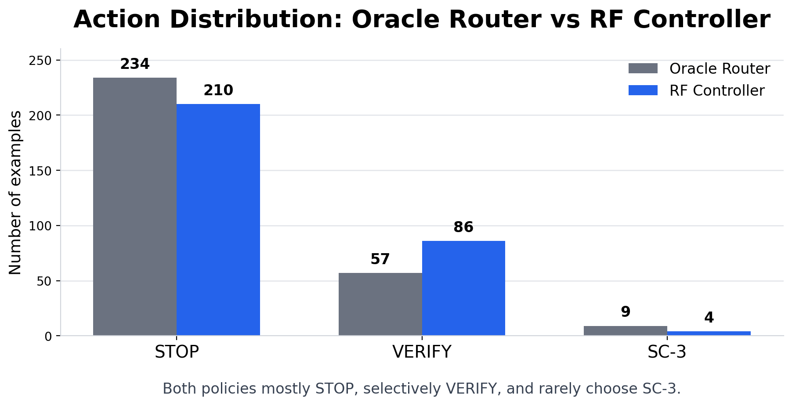

# 결과 해석 PPT 수정안

## Slide 1. Main Results

**제목:** 선택적 라우팅이 정확도-비용 trade-off를 개선

**상단 메시지:**  
추가 compute는 accuracy를 높일 수 있지만, 모든 문제에 동일하게 적용하면 token cost가 크게 증가한다.

| 방법 | Accuracy | 평균 토큰 수 | Utility | 해석 |
|---|---:|---:|---:|---|
| Always STOP | 0.253 | 299.68 | 0.222 | 가장 저렴하지만 정확도 낮음 |
| Always VERIFY | 0.370 | 916.16 | 0.275 | 정확도는 오르지만 비용 큼 |
| Always SC-3 | 0.287 | 966.53 | 0.187 | 비용 대비 효과 제한적 |
| **Oracle Router** | **0.473** | **435.65** | **0.428** | **가장 좋은 upper bound** |
| **RF Controller** | **0.430** | **484.83** | **0.380** | **학습 가능한 라우터 중 최고** |

**하단 핵심 문구:**

- Oracle Router는 Always VERIFY보다 평균 토큰을 약 52% 적게 사용하면서도 더 높은 accuracy를 달성했다.
- RF Controller도 Oracle의 선택 패턴을 일부 학습해 uniform baseline보다 높은 utility를 달성했다.

**디자인 메모:**

- `Oracle Router` 행은 연한 파란색 또는 회색으로 강조
- `RF Controller` 행은 두 번째 강조 색으로 표시
- 표 아래 문구는 2줄 이하로 유지

---

## Slide 2. Controller Training

**제목:** Controller는 Oracle action을 예측하도록 학습했다

**상단 메시지:**  
각 문제에서 STOP / VERIFY / SC-3를 모두 rollout한 뒤, utility가 가장 높은 action을 Oracle label로 사용했다.

**학습 파이프라인:**

| 단계 | 내용 |
|---|---|
| 1. Rollout 생성 | 각 문제에 대해 STOP, VERIFY, SC-3 결과를 모두 수집 |
| 2. Oracle label 생성 | `utility = correct - λ × normalized_cost`가 가장 큰 action 선택 |
| 3. Feature 추출 | 문제 길이, 숫자 개수, 초기 reasoning 길이, 초기 token 수 등 사용 |
| 4. Controller 학습 | Random Forest가 Oracle action을 예측하도록 학습 |
| 5. Calibration | validation set에서 VERIFY / SC-3 선택 threshold 조정 |

**사용한 feature:**

- Question-level feature: question length, word count, numeric token count, arithmetic symbol count
- Initial-state feature: initial reasoning length, answer format validity, numeric answer extracted
- Token feature: initial input / output / total tokens

**데이터 분할:**

- 전체 300 examples
- Train 211 / Validation 42 / Test 47
- Seed 7, λ = 0.1

**하단 핵심 문구:**  
Controller는 정답을 직접 보는 것이 아니라, initial reasoning state에서 Oracle의 선택을 따라 하도록 학습된다.

**디자인 메모:**

- 이 슬라이드는 결과표 앞에 배치하면 RF Controller가 갑자기 등장하지 않아서 흐름이 자연스러움
- 파이프라인은 `Rollout → Oracle label → Features → RF training → Calibration` 흐름도로 보여주면 좋음
- feature 목록은 너무 길면 3개 묶음으로만 표시

---

## Slide 3. Oracle Router vs RF Controller

**제목:** Oracle은 upper bound, RF Controller는 실제 적용 가능한 learned router

| 구분 | Oracle Router | RF Controller |
|---|---|---|
| 선택 방식 | 모든 action 결과를 사후적으로 비교 | initial reasoning feature만 보고 예측 |
| 정답 정보 사용 | 사용함 | 사용하지 않음 |
| 다른 action 결과 | 모두 알고 있음 | 모름 |
| 역할 | 라우팅의 upper bound | 실제 적용 가능한 controller |
| 해석 | “완벽히 고르면 어디까지 가능한가?” | “학습으로 얼마나 따라갈 수 있는가?” |

**RF Controller 핵심 수치:**

- Best learned controller: calibrated Random Forest
- Accuracy: 0.430
- Utility: 0.380
- Action 분포: STOP 210 / VERIFY 86 / SC-3 4

**하단 핵심 문구:**  
RF Controller가 Oracle보다 낮은 것은 자연스럽다. 중요한 점은 정답을 모르는 상태에서도 uniform baseline보다 더 나은 accuracy-cost trade-off를 만든다는 것이다.

**디자인 메모:**

- 왼쪽에는 Oracle Router, 오른쪽에는 RF Controller 비교 박스 배치
- RF 핵심 수치는 오른쪽 하단에 작은 callout으로 넣기
- 텍스트가 많으면 비교표 대신 2-column 카드 형태 추천

---

## Slide 4. Action Distribution

**제목:** 좋은 라우팅 정책은 대부분 멈추고, 필요한 경우만 검증한다

**삽입할 그래프:**  
`outputs/action_distribution_oracle_vs_rf.png`

| Router | STOP | VERIFY | SC-3 |
|---|---:|---:|---:|
| Oracle Router | 234 | 57 | 9 |
| RF Controller | 210 | 86 | 4 |

**PPT 본문 문구:**

- Oracle은 대부분의 문제에서 STOP을 선택하고, 일부 문제에서만 VERIFY를 사용했다.
- RF Controller도 비슷하게 STOP 중심의 보수적인 정책을 학습했다.
- 두 라우터 모두 SC-3는 거의 선택하지 않았다.

**하단 핵심 문구:**  
추가 compute를 많이 쓰는 것이 핵심이 아니라, 쓸 가치가 있는 문제를 고르는 것이 핵심이다.

**디자인 메모:**

- STOP / VERIFY / SC-3 색을 고정해서 이후 슬라이드와 일관성 유지
- STOP은 회색, VERIFY는 파란색, SC-3는 주황색 정도 추천
- 막대 위에 count 숫자 표시하면 발표자가 설명하기 쉬움

---

## Slide 5. VERIFY vs SC-3

**제목:** 이 실험에서는 탐색보다 검증이 더 효과적이었다

| 전략 | Accuracy | 평균 토큰 수 | Utility |
|---|---:|---:|---:|
| Always VERIFY | 0.370 | 916.16 | 0.275 |
| Always SC-3 | 0.287 | 966.53 | 0.187 |

**PPT 본문 문구:**

- VERIFY는 문제를 다시 풀고 기존 답을 검토하는 방식이다.
- SC-3는 추가 독립 풀이를 생성하고 plurality vote를 수행하는 방식이다.
- GSM8K와 Qwen 모델 세팅에서는 VERIFY가 SC-3보다 더 높은 accuracy와 utility를 보였다.

**하단 핵심 문구:**  
SC-3는 가장 많은 토큰을 사용했지만, 비용 대비 성능 향상은 제한적이었다.

**디자인 메모:**

- VERIFY 수치를 파란색으로 강조
- SC-3의 높은 token cost와 낮은 utility를 함께 표시
- “SC-3가 항상 나쁘다”가 아니라 “이 실험 세팅에서는 약했다”는 톤 유지

---

## Slide 6. Model Comparison

**제목:** 더 큰 모델에서 VERIFY 효과가 더 강하게 나타났다

| 모델 | STOP | VERIFY | Oracle | Best Controller |
|---|---:|---:|---:|---:|
| Qwen2.5-1.5B | 0.290 | 0.440 | 0.530 | 0.470 |
| Qwen2.5-3B | 0.320 | 0.540 | 0.600 | 0.540 |

**PPT 본문 문구:**

- 3B 모델은 STOP, VERIFY, Oracle, Best Controller 모두에서 1.5B보다 높은 정확도를 보였다.
- 특히 VERIFY 성능 향상이 가장 크게 나타났다.
- 더 큰 모델은 verification prompt를 활용해 초기 오류를 수정하는 능력이 더 강한 것으로 해석할 수 있다.

**하단 주의 문구:**  
3B 실험은 100 examples 기준이므로, 주된 결론보다는 보조적인 근거로 해석한다.

**디자인 메모:**

- VERIFY 열을 강조해서 0.440 → 0.540 향상이 보이게 하기
- 가능하면 `+0.100` annotation 추가

---

## Slide 7. Summary

**제목:** 결과가 의미하는 것

**PPT 본문 문구:**

- Extra compute는 유용하지만, 모든 문제에 동일하게 유용하지는 않다.
- VERIFY는 SC-3보다 더 높은 utility를 보였다.
- Oracle은 대부분 STOP, 일부 VERIFY를 선택했다.
- RF Controller도 이 보수적인 routing pattern을 일부 학습했다.
- 핵심 과제는 “언제 검증이 오답을 정답으로 바꾸는가”를 예측하는 것이다.

**마무리 문구:**  
**When to verify?**  
추가 compute routing의 핵심은 더 많이 생성하는 것이 아니라, 고칠 수 있는 문제를 찾는 것이다.

**디자인 메모:**

- 마지막 문구는 슬라이드 하단에 크게 배치
- Summary bullet은 5개 이하 유지
- 굵게 처리할 문장은 마지막 1개만 선택
